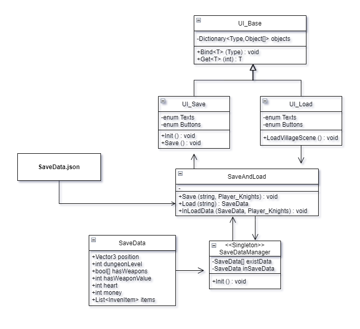

## Save-Load

## UML

  
### 개발과정
- 게임 기획 단계에서 RPG의 성장 재미를 가져올 수 있는 부분이 어떤 부분이 있을까 팀원들과 의견을 나눠 Save를 통해 플레이어가 얻은 아이템, 던전 레벨 등의 정보를 저장하여
    
    다음에 플레이 할 때 `이어할 수 있게 한다면 성장 재미를 느낄 수 있을 것 같다는 의견이 나와 Save & Load를 구현`하게 되었습니다.
    
- 서버가 따로 존재하지 않는 게임이기에 로컬 저장 방식을 `기존 인벤토리 개발 과정에서 공부했던 직렬화, 역직렬화, JsonUtility를 응용하여 구현`하였습니다.
- Load 부분에 있어 필요로 하는 플레이어가 착용중인 무기, 던전 레벨 등의 정보들을 `SaveData Class를 생성하여 Save 단계에서 직렬화를 통해 Json 파일로 저장하였고 Load 단계에서 Json파일을 SaveData 객체로 역직렬화해 정보를 입혀주는 식으로 구현`하게 되었습니다.

### 간단한 클래스 설명

${\textsf{\color\{red}Ctrl + 클릭을 통해 새창열기로 쉽게 코드를 확인하실 수 있습니다.}}$

- [**SaveDataManager.cs**](https://github.com/shji0318/Save-Load/blob/main/Scripts/SaveDataManager.cs)
  - 싱글톤 디자인 패턴 사용
  - 로컬 경로에 파일이 존재하는지 확인 후, 존재한다면 저장하는 업무를 하는 스크립트
  - Save할 경우, 새로 저장한 파일도 필요할 때 업데이트 해주기 위해서 ,Init() 함수를 따로 구현

 
- [**SaveAndLoad.cs**](https://github.com/shji0318/Save-Load/blob/main/Scripts/SaveAndLoad.cs)
  - 저장과 불러오기를 static으로 구현해놓은 스크립트
  - 위치, 던전 레벨, 착용중인 무기와 값, 체력, 돈, 인벤토리를 저장하며, 직렬화를 통해 json파일로 로컬에 저장하는 함수 (Save() 부분)
  - 로컬에 저장되어 있는 json 파일들을 역직렬화를 통해 SaveData class 형식으로 불러온 후 반환 하는 함수         (Load() 부분)
  - Player 오브젝트와 SaveData를 받아 정보를 입력하는 함수 (InLoadData() 부분)

 
- [**SaveData.cs**](https://github.com/shji0318/Save-Load/blob/main/Scripts/SaveData.cs)
  - 저장될 변수를 정의해 놓은 클래스
  - json 형식으로 저장하기 위해 직렬화 선언

 
- [**UI_Base.cs**](https://github.com/shji0318/Save-Load/blob/main/Scripts/UI_Base.cs)
  - 각종 UI 오브젝트에 사용하기 위해 정의한 스크립트
  - Bind를 통해 하위에 있는 오브젝트들을 미리 Dictionary에 저장해 놓고 Get을 통해 사용하기 위함

 
- [**UI_Save.cs**](https://github.com/shji0318/Save-Load/blob/main/Scripts/UI_Save.cs)
  - Player에게 제공되는 저장 UI를 관리하는 스크립트
  - UI_Base를 상속, Bind 할 오브젝트들의 이름을 타입 별로 Enum으로 열거 후, Dictionary에 저장하여 사용
  - UI에서 SaveData 존재하는 슬롯만 슬롯 정보를 변경하며, 슬 onClick Event 할당 (Init() 부분)
  - path 경로에 파일을 저장한 후, 초기화 및 Event 할당 (Save() 부분)
 

- [**UI_Load.cs**](https://github.com/shji0318/Save-Load/blob/main/Scripts/UI_Load.cs)
  - Main Scene에서 Player에게 제공되는 UI 스크립트
  - UI_Base를 상속
  - UI_Save와 마찬가지로 사용할 Object를 Bind, Get 하여 사용하는 방식
  - 로컬 경로에 SaveData 파일이 존재하는 지 확인 후, 존재한다면 onClick Event를 할당
  - onClick Event가 발생한 버튼 오브젝트를 받아와 그와 일치하는 SaveData 파일을 InSaveData에 저장한 후 VillageScene으로 넘어감 (LoadVillageScene() 부분)
